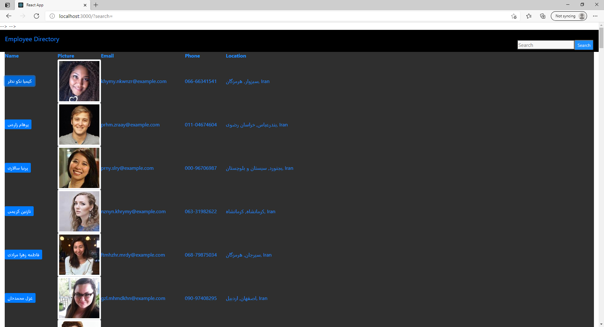
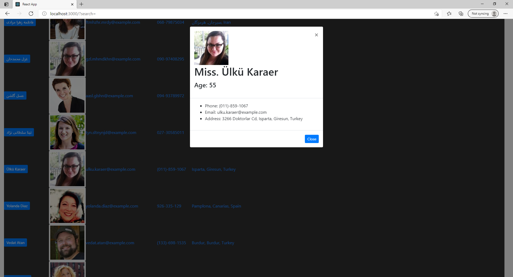

# Employee-Directory

As a user, I want to be able to view my entire employee directory at once so that I have quick access to their information.

### Picture1:

### Picture2:

---

## About the project

For this assignment, i create a employee directory with React. This assignment will require you to break up your application's UI into components, manage component state, and respond to user events.

## Run
**1.Run in the command line** - `npm install`
**2.Run the this command to start your server** - `npm start`

##### Credits:
* [npm](https://www.npmjs.com/)
* [Bootstrap](https://getbootstrap.com/)
* [Google](https://www.google.com/)
* [W3Schools](https://www.w3schools.com/)

##### Contributors:

* matachemarius92@gmail.com
* [Matache Marius](https://github.com/MatacheMarius)
##### Directory:
* [Current Repository](https://github.com/MatacheMarius/Employee-Directory)
* [Website](https://matachemarius.github.io/Employee-Directory/)
